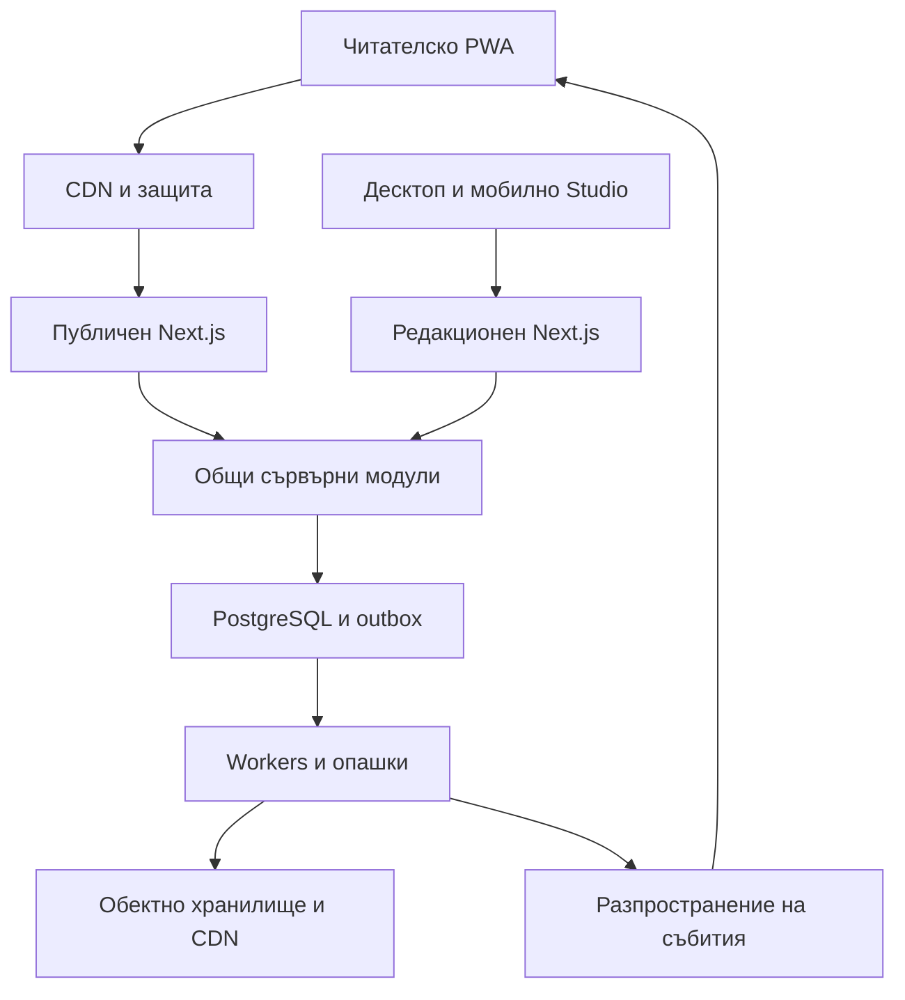

# NewsPoint 2.0
## Общ продуктов и технически план за разработка в Cursor

Версия 2.0 · 24 септември 2026 г. · Работен език: български

**Предназначение:** този документ е общата спецификация за изграждането на NewsPoint 2.0 в Cursor. Събира одобрената идея, предоставените визуални макети, архитектурния план и последващите решения на Коце. Съдържа обхват, зависимости, задачи, критерии за приемане и инструкции за работа с различни AI модели.

**Текущ статус:** продуктово и архитектурно планиране. Няма потвърдена работеща реализация, мигрирана база или проведени тестове за натоварване. Чеклистите по-долу описват работа, която предстои.

**Приоритет на решенията:** последващите изрични решения на Коце → този общ план → оригиналната презентация и макети → старите работни бележки. Промяна в потвърдено изискване се записва като решение с причина. Примерните заглавия и числа от макетите не са реални новини или аналитика.

## Съдържание

1. Цел и потвърдени решения
2. Обхват и приоритети
3. Визуална система и публични екрани
4. Жива персонализирана начална страница
5. Собствен редакционен панел
6. Двете PWA приложения
7. Архитектура и организация на кода
8. Модел на данните и договори между модулите
9. Публикуване и разпространение
10. Кеш, медии, търсене и интеграции
11. Миграция и SEO
12. Сигурност, наблюдение и възстановяване
13. Измерими цели и тестове
14. Етапи на изпълнение
15. Работа в Cursor
16. Отворени решения и стартов пакет
17. Технически източници

## 1. Цел и потвърдени решения

NewsPoint.bg преминава от WordPress към собствена платформа за национални новини със силна идентичност в Пловдив и региона. Първото впечатление идва от визията и UX; повторното посещение — от актуалността, качеството на съдържанието и полезността за читателя.

### 1.1 Задължителни решения

| ID | Решение | Следствие за реализацията |
| --- | --- | --- |
| D01 | Изцяло собствена платформа | WordPress остава източник за миграция; не е backend на новата версия |
| D02 | Собствен CMS и админ панел | Не се внедрява Payload или друг готов CMS вместо договорения панел |
| D03 | Познат десктоп редакционен процес | Навигация и основни операции, близки до познатия WordPress модел, с подобрени инструменти |
| D04 | Отделно редакционно PWA | Журналистите работят удобно от телефон; отделна инсталация от читателското приложение |
| D05 | Мобилният админ има собствен UX | Екрани, навигация и взаимодействия като мобилно приложение; отделна композиция от десктопа |
| D06 | Читателско PWA | Самостоятелно мобилно преживяване, запазени материали, известия и навигация за телефон |
| D07 | Светъл и тъмен режим | И двата следват предоставените референции и се проверяват визуално |
| D08 | Самопреподреждаща се начална страница | Автоматично обновяване и персонализация, докато страницата е отворена, без F5 |
| D09 | Редакционен контрол над началната страница | Водещи, извънредни и промотирани новини имат задължителни позиции/правила |
| D10 | Защита на архива и URL адресите | Всеки необходим стар адрес се запазва или получава точен redirect |
| D11 | Архитектура за внезапни пикове | Публично четене през CDN, асинхронна обработка, измерване на cold cache и real-time трафик |
| D12 | Разработка в Cursor с различни модели | Решенията и текущото състояние се пазят в git и документацията, а не само в чатовете |

Собствен CMS позволява използването на поддържани библиотеки за редактор, автентикация, обработка на изображения и UI елементи. Собствените части са продуктът, работният процес, моделът на данните и управлението на медията.

### 1.2 Референции за проекта

Копирай в `docs/references/`:

- `demoDesktopMobileScreenLight.png` — светъл режим, десктоп, таблет и телефон.
- `demoDesktopMobileScreenDark.png` — тъмен режим и мобилни екрани.
- `detail view.png` — детайлна статия.
- `NewsPointPresentation.docx` — представената на собствениците продуктова идея.
- `NewsPoint_bg_2.0_Architecture_Plan.docx` — първоначалната архитектура.

Сегашният newspoint.bg е източник за архив, таксономии, URL-и и редакционни нужди. Точният обем съдържание, потребителският трафик и вътрешните процеси още не са измерени. Публичният оглед не замества WordPress експорт и Search Console.

## 2. Обхват и приоритети

### 2.1 Задължителен продукт за пускане

- Публични начална страница, рубрика, статия, тема, автор, търсене, архив и служебни страници.
- Пълна визуална система в двата режима, mobile-first UI и достъпност.
- Автоматично обновяване и пренареждане на адаптивните секции с редакционни ограничения.
- Собствен CMS: съдържание, роли, медии, чернови, ревизии, одобрение, планиране и публикация.
- Десктоп и мобилен редакционен интерфейс, читателско PWA и отделно редакционно PWA.
- Миграция, редиректи, SEO метаданни, sitemap, RSS и проверка на старите медийни адреси.
- Теми и свързани истории, запазване на материали на устройството, управление на интересите.
- Читателски сигнали и контактна форма, управление на реалните рекламни позиции.
- Наблюдение, резервни копия, възстановяване и контролирано пускане.

### 2.2 Функции от презентацията и макетите

AI резюметата, Пловдив Live, push и рекламните зони са в одобрената презентация. Бюлетинът, анкетите, реакциите и коментарите идват от макетите или текущия сайт; включваме ги в работния план, като точният им обхват и правила се решават в P0. Реализацията е след основния поток. Обещана функция се отлага само с изрично записана промяна на обхвата от Коце.

| Функция | Първа реализация | Зависимост |
| --- | --- | --- |
| AI резюме | До 3 основни точки, проверени от редактор, вързани към версия на статията | Избран доставчик, бюджет и редакционен преглед |
| Пловдив сега / Live | Време и редакционни местни известия с източник и срок | Надеждни данни; камери и автоматичен трафик само при осигурен достъп и права |
| Push известия | Извънредни и избрани теми, предпочитания и ограничение на честотата | Доставчик/собствен Web Push канал и реални устройства |
| Бюлетин | Абонамент, потвърждение, отписване и редакционен подбор | Имейл доставчик и настроен домейн |
| Анкети | Единичен въпрос, срок, резултати, базова защита от злоупотреба | Решение за анонимно участие |
| Реакции и коментари | Ограничен набор реакции и модерирана дискусия | Правила, идентичност на автора и човек за модерация |

Коментарите могат да останат изключени при пускане само с изрично записано решение; тогава липсващите действия и броячи се скриват в UI. Не се показват демонстрационни стойности като истински.

### 2.3 След стабилно пускане

- Разширен liveblog, аудио версии, автоматично социално разпространение, карти и повече местни източници.
- Синхронизирани читателски профили между устройства, ако са нужни; гостовото четене остава възможно.
- По-сложен препоръчващ модел след събиране на достатъчно качествени данни.
- Съвместно редактиране в реално време, пълна рекламна платформа и собствени видео стрийминг услуги само след отделна оценка.

Първата версия не изисква Kubernetes, мрежа от микросервизи, собствена криптография или езиков модел при всяко отваряне на страницата.

## 3. Визуална система и публични екрани

### 3.1 Дизайн преди масовата реализация

Извличат се и се фиксират design tokens: цветове за всеки режим, типография на кирилица, разстояния, радиуси, рамки, сенки, ширини на колоните и движение. Цветовите стойности се измерват/сверяват с референциите; не се измислят като „точно съвпадение“ по памет. Логото се осигурява във векторен формат.

Изработват се минимум шест проверими екрана: начална страница, статия, рубрика, десктоп редактор, мобилно табло на редакцията и мобилен редактор. Началната и статията се проверяват в светъл и тъмен режим преди изграждане на всички останали екрани.

### 3.2 Карта на публичния интерфейс

| Екран | Основно съдържание и поведение |
| --- | --- |
| Начало | Водеща история, Последни, адаптивни секции, Пловдив сега, Най-четени, редакционни и рекламни позиции |
| Рубрика | Панорамна корица, подрубрики/филтри, актуални материали, достъпна страницирана навигация |
| Статия | Заглавие, резюме, автор, дати, снимки/галерия, текстови блокове, източници, обновления и свързани истории |
| Тема | Какво знаем, хронология, ключови статии, следене и известия |
| Автор | Биография, роли/контакти по решение на редакцията, публикации |
| Търсене | Кирилица, категории, период, добри празни състояния и ясни резултати |
| Запазени | Материали на устройството; статус на наличността им за офлайн четене |
| Настройки | Тема, размер на текста, интереси, известия, управление/изчистване на персонализацията |
| Сигнали | Текст, контакт, медии, прогрес на качване и потвърждение за получаване |

За мобилния читателски интерфейс началното предложение е долно меню „Начало / Теми / Търсене / Запазени / Още“. Окончателните етикети се сверяват с макетите и тестовете.

### 3.3 Правила за качество

- Фотографията, типографията и подредбата носят премиум усещането. Ярките градиенти служат като акценти.
- Изображенията имат предварително определени размери и правилен crop/focal point; рекламите също имат запазено място.
- Анимации обикновено 150–250 ms като начален UX ориентир; opacity/transform, без постоянни тежки ефекти.
- `prefers-reduced-motion`, видим keyboard focus, смислени labels, контраст и цели за докосване около 44×44 CSS px.
- Дълги български заглавия, липсваща снимка, бавна мрежа, празни данни и грешки се проектират предварително.
- Функциите работят с клавиатура и screen reader; жестовете имат видима алтернатива.
- „LIVE“ означава действително активно отразяване; обикновените новини имат отделен визуален статус.
- Не се копира автоматично всяка разлика между макетите. Общият модел и съзнателните отклонения се описват в `docs/DESIGN_SYSTEM.md`.

## 4. Жива персонализирана начална страница

### 4.1 Три последователни операции

1. **Допустимо съдържание:** само публикувана и публично видима версия, валиден срок, готови медии, правилна рубрика.
2. **Редакционни ограничения:** фиксирани позиции, извънредни новини, минимално присъствие на Пловдив/Последни, рекламни зони и изключени материали.
3. **Персонално подреждане:** избор и ред на останалите карти и тематични редове.

Редакторското фиксиране е твърдо ограничение. Не се свежда до бонус в рейтинга, който друг материал може случайно да надмине.

### 4.2 Първи алгоритъм

Прозрачен алгоритъм с правила и оценка на кандидатите е достатъчен за старт. Той работи върху ограничен набор публични материали, а не сканира целия архив на всеки читател.

Примерни начални тегла за нормализирани сигнали, които се калибрират с тестове:

- 30% изрично избрани/следени теми и интереси;
- 25% свежест според типа материал;
- 20% редакционна значимост за свободните позиции;
- 15% местна полезност;
- 10% проверен агрегатен интерес.

След оценяването се прилагат ограничения за разнообразие, дублирани събития и вече видени карти. Дълъг анализ и кратка извънредна новина имат различна скорост на остаряване. Новите материали получават възможност да бъдат видени и при липса на история от кликове.

Начални сигнали: следване/отследване, „по-малко от тази тема“, запазване, активен прочит и повторно посещение. Времето в неактивен таб не е активен прочит. Един случаен клик има малка тежест; старите интереси отслабват. Не се извеждат политически убеждения, здравен профил или други чувствителни характеристики на човека от прочетените новини.

### 4.3 Персонализация без разрушаване на CDN кеша

- Сървърът връща обща редакционна страница със съдържание, което е полезно още преди JavaScript.
- Обновяем публичен snapshot съдържа компактни карти, секции, редакционни правила и `layoutVersion`.
- При гостов режим изборът на интереси и началното пренареждане могат да се извършват на устройството върху този snapshot. Това е препоръчаният първи подход.
- Ако се добави профил, синхронизираните предпочитания се получават от отделен private endpoint. Персонални отговори не се кешират общо.
- HTML за бот и за неперсонализиран читател има еднаква редакционна основа. Не се прави скрита алтернативна версия за търсачки.
- При липса на сигнали, отказ от персонализация или грешка се показва редакционната подредба.

### 4.4 Реално време

За целевото преживяване се планира SSE или еквивалентен канал за събития от сървъра към активните клиенти. Изборът на инфраструктура и разходите за връзки се доказват в първия технически прототип. Периодични заявки са резервен режим и инструмент за възстановяване, а не заместител на потвърденото изискване.

Публичното събитие съдържа `eventId`, `type`, `entityId`, `version`, `occurredAt`, `layoutVersion` и засегнати теми. Няма чернови, служебни идентификатори или потребителски данни.

- Събития: нов материал, обновена история, промяна на водеща новина, промяна на подредбата, оттеглен материал.
- Клиентът обединява близки събития и изтегля нужните публични промени. Един поток обслужва целия интерфейс.
- При прекъсване: backoff с jitter, последен event ID и възстановяване чрез актуален snapshot, ако историята е изтекла.
- Неактивните табове намаляват/спират активността; при връщане сверяват версията. Push е отделен механизъм за затворено приложение.
- Оттеглянето се отразява приоритетно. Старата карта не остава препоръчана само защото има висок интерес.

### 4.5 Пренареждане без загуба на място

Променя се и редът на секциите, и съдържанието в тях. Запазват се идентификатори на картите и контекстът на навигацията.

- Не се премества фокусиран елемент или карта под активно докосване.
- Видимият район и кратка зона около него остават стабилни по време на скрол и взаимодействие.
- Автоматичното пренареждане се прилага на безопасна пауза или извън тази зона, със запазване на scroll anchor. Промяна над екрана не трябва да измести четеното съдържание.
- Има ограничение на честотата и минимална разлика в оценката за смяна на позиции, за да не се разменят две карти непрекъснато.
- Извънредно съобщение използва предварително предвидена зона и не измества целия екран.
- По желание читателят избира стабилна редакционна подредба; автоматичната персонална остава основното договорено преживяване.

**Приемане:** две сесии с различни интереси виждат различни адаптивни секции; редакторската водеща е обща; публикация и промяна на водещата пристигат без F5; тест с 20 последователни събития не губи фокус, scroll position или карти.

## 5. Собствен редакционен панел

### 5.1 Модули

| Модул | Изисквания |
| --- | --- |
| Табло | Мои чернови, за одобрение, планирани публикации, сигнали, проблемни качвания и разпространения |
| Публикации | Търсене, филтри, статус, автор, рубрика, масови разрешени действия и история |
| Редактор | Структурирани блокове, autosave, preview, снимка, автор, SEO, категория, тагове и проверки |
| Медии | Качване, търсене, crop, focal point, авторски права, надпис, alt, статус на обработката |
| Начална страница | Позволени шаблони, фиксирани позиции, срок на промотиране, приоритети, preview за различни интереси |
| Теми и местни данни | Хронология, връзки между истории, Пловдив сега, източник и срок |
| Аудитория | Известия, бюлетин, настройки на следенето, сигнали, модерация и анкети |
| Реклама | Позиции, креативи, период, приоритет, спонсорирано обозначение и договорени отчети |
| Управление | Екип, роли, менюта, рубрики, автори, страници, редиректи, SEO defaults и интеграции |
| Състояние | Публикуване, sync, jobs, failed tasks и ясни действия за възстановяване според ролята |

Управлението на началната страница работи с ограничен каталог качествени секции. Универсален page builder с произволен HTML не е необходим за първата версия.

### 5.2 Работен процес

Статуси: `draft → in_review → approved → scheduled/published → archived/withdrawn`. Редактор с право за директна публикация може да прескочи одобрението; действието се записва. Работа върху нова чернова на вече публикуван материал не променя публичната версия.

Репортерът предлага; редакторът одобрява/публикува в разрешения му обхват; главният редактор управлява водещи и оттегляния; администраторът управлява системата. Разрешенията се проверяват на сървъра при всяка операция. Техническият администратор не получава непременно право да публикува без отделна редакционна роля.

Редакторът предлага: autosave, видим статус „запазено локално / синхронизирано / има конфликт“, история, сравнение на версии, мобилен и десктоп preview, планиране с часова зона Europe/Sofia и проверки за основна снимка/източник/платено съдържание.

Първо се реализират optimistic concurrency и предупреждение за друг редактор. Записът носи `expectedVersion`; конфликтът връща 409 и избор за сравнение/възстановяване. Едновременно писане като Google Docs може да се добави по-късно.

## 6. Двете PWA приложения

Препоръчани адреси за планиране: `newspoint.bg` за читатели и `studio.newspoint.bg` за редакцията. Това е предложение за инфраструктура, не вече създаден поддомейн.

| Свойство | Читателско PWA | Редакционно PWA |
| --- | --- | --- |
| Идентичност | NewsPoint | NewsPoint Studio, работно име |
| Основни задачи | Четене, следене, търсене, запазване | Чернова, снимка/видео, преглед, одобрение, публикация |
| Интерфейс | Новинарско приложение | Мобилна работна среда |
| Достъп | Гостов; профил при нужда | Удостоверен потребител с роля |
| Офлайн | Изрично запазени статии и app shell | Локални чернови и опашка за синхронизация |
| Известия | Избрани новини и теми | Задачи и одобрения при нужда |

Отделни manifest `id`, икони, `start_url`, service worker scopes и cache namespaces. Сесиите на Studio са host-only и не се споделят с публичния сайт. И двете приложения използват една редакционна логика и база чрез сървърни модули.

### 6.1 Мобилно Studio

Предложено меню: „Табло / Материали / Нов / Медии / Още“. Екраните имат големи действия, безопасни зони около системните контроли, правилна работа с клавиатурата и удобно връщане. Качването показва прогрес, прекъсване и възстановяване; няма неясно „готово“, преди сървърът да потвърди.

Локалната чернова се пази по потребител и материал, със срок и ясно действие за изчистване. При logout се прилага изрично описана политика за локалните данни. IndexedDB не се представя като защита на тайни върху компрометиран телефон. API отговорите и черновите не влизат в общ service worker cache.

Офлайн се пише; публикуването изисква връзка, актуална сесия и повторна проверка на правата. Загубена сесия не изтрива незапазения текст, но не позволява неразрешен upload/publish.

### 6.2 Реални ограничения и приемане

PWA трябва да изглежда и да се държи като приложение в рамките на възможностите на браузъра. Инсталацията, push и работа на заден план се проверяват отделно на iPhone и Android; не се обещава непрекъснато качване при заключен екран.

Service worker update не презарежда активен редактор с незапазена работа. Показва се „Има нова версия“, запазва се съдържанието и обновяването става безопасно. Локалните данни имат schema version и миграция.

Приемане на реални устройства: инсталиране, студено стартиране, системен Back, външен линк към статия, push, текстова клавиатура, спиране/пускане на мрежата, възстановяване след затваряне и повторно влизане.

## 7. Архитектура и организация на кода

### 7.1 Предложена начална архитектура

Един TypeScript monorepo с ясно разделени модули. Две приложения и отделен worker процес; общ domain слой. Увеличаваме броя услуги само при конкретен измерен проблем.



CDN HIT обслужва готовата публична страница без заявка към приложението. Диаграмата показва и пътя при нужда от origin.

### 7.2 Стек и ограничения

| Компонент | Начално решение |
| --- | --- |
| Приложения | Next.js App Router, съвместима React версия, TypeScript strict; React 19 е отправната точка от презентацията |
| Версии | Проверка на поддържани стабилни версии при bootstrap; lockfile и записани версии, без автоматична смяна между модели |
| UI | Tailwind/CSS tokens, достъпни primitives, собствен дизайн; минимални client components за публичните страници |
| База | PostgreSQL с migrations, ограничен pool; managed услуга с backups и production failover според договореното ниво |
| Достъп до данни | Предложение: Drizzle ORM; окончателно се фиксира в ADR преди schema реализация |
| Редактор | Предложение: Tiptap core за rich text в собствените блокове; проверка на лицензите на всяко разширение |
| Validation | Един споделен набор runtime schemas, например Zod, и TypeScript договори |
| Jobs | BullMQ с потвърдена Redis/Valkey съвместимост; retries, ограничен concurrency, DLQ/failed jobs |
| Media | S3-compatible storage, responsive variants и CDN; обработка в worker |
| Real-time | SSE през отделно мащабируемо разпространение или managed realtime adapter; избира се след spike |
| Тестове | Unit/integration runner и Playwright за ключови потребителски потоци; k6 или еквивалент за натоварване |
| Локална среда | Docker Compose за DB, Redis и S3-compatible test storage; документиран Windows/WSL2 старт |

Доставчици, Node версия, auth библиотека и конкретни пакети се фиксират при Phase 0 след проверка на поддръжката и цената. Собствена автентикационна криптография не се разработва.

### 7.3 Redis и кешове

Кешът допуска изхвърляне на данни; опашките не трябва да губят ключове при запълване на паметта. В production queue Redis е с подходяща устойчивост и `noeviction`, отделен от изхвърляемия кеш при натоварване. Различни logical DB номера сами по себе си не изолират паметта и eviction политиката. [S5]

Redis/Valkey държи hot data, locks и агрегати, но публикуваното съдържание и важните събития имат устойчив източник в PostgreSQL. Наличието на Redis не означава, че всяка заявка е длъжна да минава през него.

### 7.4 Предложена структура на проекта

| Път | Отговорност |
| --- | --- |
| `apps/web` | Публичният сайт и читателското PWA |
| `apps/studio` | Десктоп CMS и мобилно редакционно PWA |
| `apps/worker` | Медии, публикации, индексиране, AI, известия и outbox доставка |
| `packages/domain` | Сървърни правила за съдържание, публикации, роли и подредба |
| `packages/db` | Schema, migrations, repository достъп и тестови данни |
| `packages/contracts` | API/event schemas, грешки и версии |
| `packages/ui` | Tokens и споделени primitives; отделни композиции за двата UX |
| `packages/content` | Блокове, валидиране, безопасно рендериране и legacy import |
| `packages/ranking` | Чисти детерминистични правила и тестове за персонализация |
| `packages/integrations` | Storage, CDN, realtime, mail, push, AI адаптери |
| `scripts/migration` | WordPress import, URL map, проверки и delta import |
| `tests` | Интеграционни, E2E, визуални и load сценарии |
| `docs` | План, ADR, задачи, състояние, референции и runbooks |

Сървърните пакети не се включват в браузърния bundle. Web и Studio не дублират правилата за публикуване. Началният API слой може да е в двете Next.js приложения с общи services; отделен REST backend се въвежда само ако стане необходим.

### 7.5 Production капацитет и разходи

За стартовата production конфигурация се планират минимум две public origin инстанции зад health checks, ако целта включва устойчивост при отказ на origin. Studio и media workers имат отделени ресурсни лимити, така че обработката на видео да не блокира редакторите. Само DB failover не покрива отказ на целия регион, load balancer или realtime доставчик; тези ограничения се записват в договореното ниво на наличност.

DB connection pool има общ бюджет за всички процеси. Основните заявки за статус/дата/категория/slug се индексират и преглеждат с реалистичен обем данни. Студеното генериране използва single-flight за ключ/версия; distributed lock има token, срок и безопасно освобождаване. При празен кеш няма stale копие за връщане — необходими са ограничена конкурентност, timeout и предвидима деградация.

В P0 се попълва разходен лист за origin compute, managed DB, queue/cache, storage, media processing/traffic, realtime връзки/съобщения, mail/push, AI, мониторинг и backups. Изчисляват се нормален месец и месец с голям пик. За трафика се ползват брой посещения × измерени bytes на посещение; за realtime — активни връзки × време и реален fan-out. Цени и лимити се вземат от избраните доставчици към датата на поръчката. Не се обещава 100K капацитет в неуточнен месечен бюджет.

## 8. Модел на данните и договори между модулите

### 8.1 Основни същности

| Група | Същности и важни полета |
| --- | --- |
| Редакция | StaffUser, Role, Permission, Session, AuditLog |
| Съдържание | Article, ArticleRevision, Author, Category, Tag, Topic, ArticleTopic |
| Публикувана версия | `publishedRevisionId`, `draftRevisionId`, `version`, `publishedAt`, `updatedAt`, `visibility` |
| URL-и | CanonicalPath, Redirect, LegacyMapping с `sourceSystem` и `legacyId` |
| Медии | Asset, AssetVariant, UploadSession, MIME, checksum, caption, credit, rights, focal point |
| Начална страница | HomeLayout, SectionConfig, EditorialPlacement, start/end, scope, layoutVersion |
| Публикация | PublicationJob, OutboxEvent, DistributionAttempt, idempotency key |
| Аудитория | Follow/Preference при профили, PushSubscription, NewsletterSubscription, ModerationItem |
| Взаимодействия | Comment, Reaction, Poll, PollVote, агрегирани ArticleMetrics |
| Допълнения | SummaryRevision, LocalNotice, AdCampaign, AdPlacement |

Категория, таг, тема, жанр и редакторски placement са различни понятия. „Водещо“, „Последни“ и „На фокус“ от стария сайт не се копират механично като равнозначни категории; mapping се одобрява при миграцията.

### 8.2 Блокове и редакции

Структурирани блокове: rich text, подзаглавие, снимка, галерия, видео, цитат, списък, таблица, fact box, свързан материал и позволен embed. Всеки блок има schema version. Код/скриптове от външен HTML не се изпълняват.

Наследено съдържание, което не може да се конвертира надеждно, използва отделен sanitized legacy block с оригинала в защитения архив и доклад за проблемите. Rich text библиотеката не определя сама целия модел на статията.

### 8.3 API правила

- Сървърна валидация на входа; разрешения на всяка mutation; paginated списъци с лимити.
- UTC в базата; Europe/Sofia в редакционния интерфейс, включително смяна на лятно време.
- Външни действия носят idempotency key; optimistic locking при редакция.
- Публикация, която изисква асинхронна обработка, връща job ID/status, а не фалшиво „успешно“.
- Грешките имат code, човекочитаемо съобщение и request ID. Логовете не включват пароли, токени или текст на чувствителни сигнали.

Примерни договори за уточняване в `packages/contracts`:

- `GET /api/public/home-snapshot` → layoutVersion, public candidates, fixed placements.
- `GET /api/public/events` → публични versioned events или URL към realtime адаптера.
- `POST /api/editor/articles/:id/revisions` → expectedVersion + blocks → revision/version.
- `POST /api/editor/articles/:id/publish` → revisionId + idempotencyKey → jobId/status.
- `POST /api/editor/uploads` → проверка → краткоживеещи upload данни.

## 9. Публикуване и разпространение

### 9.1 Надеждна последователност

1. Проверка на роля, версия, съдържание, медии и планирана дата.
2. PostgreSQL транзакция записва публичната версия/състояние и outbox event за същата версия.
3. Worker взема събитието; повтаряемите стъпки са идемпотентни.
4. Подготвя публичните read модели и обновява необходимия Next.js cache.
5. Потвърждава, че origin връща очакваната версия; извършва целеви CDN purge и прогряване.
6. Проверява публичния отговор, version ID и необходимите медии; само HTTP 200 не е достатъчен.
7. Излъчва събитието към отворените страници и разрешава планираното разпространение.
8. Push, бюлетин и социални канали работят като отделни задачи с проследим резултат.

Транзакцията към DB не прави CDN, Redis и имейл доставчика атомарни. Outbox + retries + видими състояния покриват прекъсванията. Излъчване и известия се обвързват с точна revision версия, за да не се изпрати отменен материал.

### 9.2 Критични подробности

- Next.js revalidation и CDN purge са различни стъпки. При режим stale-while-revalidate първият отговор може да е стар; warm-up проверява версията и повтаря до лимит. [S2, S3]
- Прогряване от един район не означава, че всички edge точки са топли. Cold cache остава задължителен тест.
- Има краен срок, повторни опити и състояние „Публикувана, разпространението чака/има проблем“. Не се блокира редакторът завинаги заради имейл услуга.
- При оттегляне: премахване от публичните read модели, приоритетен purge, анулиране на чакащи известия и ясно публично поведение според редакционното решение.
- Автоматичната смяна на slug на вече публикувана статия е забранена; изрична промяна създава redirect и audit запис.

## 10. Кеш, медии, търсене и интеграции

### 10.1 Cache contract

| Ресурс | Политика |
| --- | --- |
| Публична статия/рубрика/начална | Разрешен CDN cache само за публичната редакционна версия, с явен TTL и целева invalidation |
| Public snapshot/candidates | Кратък cache, version/ETag, устойчив fallback |
| RSC/client navigation | Тестван cache key или bypass до доказана коректност; да не се смесва с HTML |
| Studio, preview, сесия, профил | Private/no-store; изричен CDN и service worker bypass |
| Персонални данни | Private/no-store; никакво споделяне между посетители |
| SSE | Без HTTP object cache; лимити, heartbeat, reconnect и отделен fan-out |
| Версирани изображения и assets | Дълъг immutable cache; нов asset URL при промяна |
| Сигнали и private uploads | Защитен достъп; не са публични медии преди одобрение |

Cloudflare не кешира HTML по подразбиране. Cache rules се описват и тестват като част от проекта. Параметри за проследяване могат да се нормализират, но функционални query параметри и Next.js `_rsc` не се премахват без доказателство за коректност. Purge обхваща всички необходими варианти. [S2, S4]

При няколко Next.js инстанции се координират cache storage и tag invalidation. Само локална invalidation на една инстанция не е достатъчна. [S3]

### 10.2 Медии

Direct upload с ограничение по размер и MIME, проверка на действителния файл и права. Worker създава responsive варианти, WebP/AVIF според поддръжката, thumbnails и metadata. Оригиналите се пазят отделно; чувствителните EXIF данни не се излагат по подразбиране.

Големи видеа използват multipart/resumable upload и избрано видео решение. S3 storage сам по себе си не осигурява transcoding и адаптивен стрийминг. Външен player се зарежда при нужда; failure не блокира статията. Кешираните медии не минават през приложението при всяко посещение.

### 10.3 Търсене и броячи

Търсенето започва с PostgreSQL и индекси върху заглавие/съдържание, ако тестовете с реални български заявки са достатъчно добри. Не се предполага качествена българска морфология по подразбиране. Външен search engine се добавя при доказан проблем с релевантност или скорост.

Прочитанията се приемат като събития, агрегирани на batches. Flush към DB има batch ID/идемпотентност, за да не удвои брояча след retry. Redis reset и DB commit не се изпълняват като опасна двойка без възстановяване. „Най-четени“ има дефиниран период, филтриране на ботове и закъснение; то не е точен брояч на хора онлайн.

### 10.4 AI, местни данни и реклама

AI резюмето се генерира веднъж за revision, с лимит на разхода, редакторска проверка и ясно означение. Обновена статия прави старото резюме неактуално. Текстът на източника се третира като данни, не като инструкции за AI инструменти.

Пловдив сега има източник, време на обновяване и expiry за всяко известие. Недостъпен източник се показва като неактуален/скрит. Данни от камери и трафик се включват след осигурен достъп.

Рекламните места имат размери за устройства, период, видим sponsor label и отделни правила от редакционното промотиране. Измерване и външни scripts се включват според избраните настройки за поверителност. Рекламите не трябва да блокират взаимодействието и да разместват текста.

## 11. Миграция и SEO

### 11.1 Инвентар преди schema freeze

Осигуряват се WXR export, backup на DB, uploads, plugin/custom field списък, redirects, използваните SEO полета, публичните автори и информация за коментари/анкети. WXR самостоятелно може да не е достатъчен за всички plugin данни.

Събират се Search Console top URLs, sitemap, canonical правила, RSS и най-ценните архивни страници. Снимки/видео, права и зависими външни embed-и се описват. Самото обхождане на сайта не е надежден начин за пълна миграция.

### 11.2 Миграционна процедура

1. Dry run с разнообразни материали от различни години и формати; цел минимум 50 представителни статии.
2. Повторяем import по `sourceSystem + legacyId`; второ изпълнение не създава дубликати.
3. Запазване на slug, дати, авторство, canonical, image credit и отношенията между материали.
4. Отчет за непреобразувани блокове, невалидни файлове и липсващи връзки. Проблемите не се прикриват с празен текст.
5. Пълен import в staging, проверки на броя записи/медии и реално рендериране на извадки.
6. Финален delta import по време на кратък договорен редакционен прозорец.
7. Cutover с журнал на новите записи и възможност за reconciliation при връщане назад.

### 11.3 SEO готовност

Сървърно четимо съдържание, една основна H1, canonical, реални publication/modification dates, NewsArticle/Article, BreadcrumbList, автори, Open Graph, image metadata, sitemap index/news sitemap според приложимите правила и RSS. Архивът остава достъпен по стабилни URL-и независимо от персонализацията.

Редиректите са точни 301, без вериги и без масово насочване на несъществуващи статии към началната. Admin, preview и staging са изключени от индексиране; staging се пази и с достъп, а не само с robots.txt. Старите медийни URL-и имат запазено обслужване или mapping.

Техническото SEO не гарантира позиция в Google/Discover. Приемането проверява правилно публикуване и индексиране, а ефектът върху трафика се следи след старта.

## 12. Сигурност, наблюдение и възстановяване

- Role-based access, силни сесии, MFA за привилегировани роли, CSRF/Origin проверки, XSS защита и безопасни embeds.
- Rate limits за вход, търсене, upload, коментари и сигнали. Preview линковете са ограничени по права и срок.
- Origin достъпът е ограничен, където инфраструктурата го позволява; WAF не замества проверки в приложението.
- Secrets извън git и client bundle; разделени dev/staging/production credentials и права за доставчиците.
- Audit log за публикуване, изтриване, роли, placements и критични настройки.
- Метрики от първия работещ поток: request/job ID, грешки, publish latency, event lag, queue lag, cache HIT/MISS, DB pool, media failures.
- Персонализацията има видими контроли и reset; срокове за съхранение, основание/съгласие за съответните измервания и данни се уточняват преди активиране.
- Backups на DB и обектите, проверено възстановяване в отделна среда, отговорник и runbook.
- Примерни начални цели за договаряне: RPO до 15 минути, RTO до 60 минути; публикуваното ниво се обещава само след проверка на услугите и restore drill.
- При срив на ranking се показва редакционна подредба; при срив на realtime остава четенето и се активира ограничен fallback; при срив на AI публикацията продължава без резюме.

## 13. Измерими цели и тестове

### 13.1 Начални критерии за договаряне

| Измерване | Начална цел | Как се проверява |
| --- | --- | --- |
| Core Web Vitals | LCP ≤ 2.5 s, INP ≤ 200 ms, CLS ≤ 0.1 на p75 | Реални мобилни посещения след пускане; преди това лабораторен бюджет и устройства [S8] |
| Събитие до активен клиент | p95 ≤ 3 s след потвърдена публична готовност | Времеви отметки на producer и client |
| Публикация до видима нова версия | p95 ≤ 10 s за текст със завършени медии в договорена тестова среда | Проверка на revision на публичния URL |
| Чернова | Autosave след кратка пауза, видим резултат; без тиха загуба/презапис | Прекъсване, конфликт, повторно отваряне |
| Редакционна водеща | 100% спазване на фиксираните правила | Детерминистични ranking тестове |
| Приватност на preview | Нула изтичания в публични cache/event/snapshot отговори | Негативни интеграционни тестове |
| Миграция | Всички договорени URL-и/записи съпоставени; нула блокиращи проблеми в критичните URLs | Автоматичен отчет + визуални извадки |

Това са цели за приемане, а не постигнати резултати. Настройките и инфраструктурата се коригират според измерванията.

### 13.2 Натоварване

Първоначалната цел е 100 000 отваряния в 10–15 секунди: приблизително 6 700–10 000 стартирания на посещение в секунда. Едно посещение прави и заявки за изображения, JS, snapshots и събития; то не е равнозначно на една заявка.

Отделни сценарии:

- Warm cache: една гореща статия; измерване на HTML, assets и origin трафика.
- Cold cache: същата статия след целеви purge, различни edge точки и защита от дублирано генериране.
- Mixed traffic: начална, архив, нови URL-и, функционални query параметри и cache bypass requests.
- Real-time: договореният брой едновременни отворени клиенти, масово събитие, повторно свързване и snapshot изтегляне.
- Редакция по време на пик: publish, update, withdrawal и ranking update под товар.
- Failure: worker restart, Redis/DB недостъпност, purge error, queue backlog, provider timeout и restore.

Мери се p50/p95/p99, грешки, origin RPS, HIT ratio, DB connections/CPU/IO, активни realtime връзки, event lag и цена. Първо се доказва устойчивият origin капацитет C; позволените origin заявки по време на пика се ограничават с резерв спрямо C. „99% HIT“ не е достатъчен сам по себе си критерий.

Големите тестове се изпълняват постепенно в контролирана среда, със съгласувани лимити/разходи към доставчика. Един генератор от един регион не доказва глобален cold cache сценарий. Целта за 100 000 активни realtime клиента се приема отделно от 100 000 кратки отваряния.

## 14. Етапи на изпълнение

Работата се движи по измерими резултати. Няма фиктивни календарни обещания преди инвентар, бюджет и първите завършени задачи. Всички етапи започват със статус `not_started`.

### P0 — Подготовка и заключване на основните решения

**Задачи:** P0-01 подредба на docs/референции; P0-02 WordPress inventory и 50 примера; P0-03 роли и редакционни задачи; P0-04 хостинг/бюджет/региони; P0-05 stack/auth/editor/realtime ADR; P0-06 route map и content schema draft.

**Резултат:** документация, task board, записани допускания и blocker register.

**Приемане:** собствен CMS и двете PWA са фиксирани; персонализацията е core; vendor решенията са конкретни или имат adapter и срок за избор. Липсващ export не пречи на дизайн и scaffold, но спира schema freeze за миграцията.

### P1 — Дизайн система и интерактивни прототипи

**Задачи:** P1-01 tokens и кирилица; P1-02 публични home/article/category; P1-03 Studio desktop; P1-04 Studio mobile; P1-05 live reorder demo с ясни демонстрационни данни; P1-06 loading/error/offline states.

**Резултат:** екрани в двата режима и сценарий с две различни предпочитания.

**Приемане:** визуално сравнение с референциите, реален телефон, keyboard/reduced motion, без generic dashboard визия в публичната част. Прототипът не се отчита като backend реализация.

### P2 — Основи и ранен технически прототип

**Задачи:** P2-01 monorepo/lockfile/CI; P2-02 DB migrations/auth/permissions; P2-03 една статия и revision; P2-04 публикуване през outbox; P2-05 CDN contract и revision verification; P2-06 реално събитие към две отворени страници.

**Резултат:** работещ път редактор → preview → publish → кеширана статия → live update.

**Приемане:** restart не губи publish job; двоен клик не дублира; preview остава private; тестът върви върху избраната staging инфраструктура. Този етап открива рано проблемите в Next.js/CDN/realtime, преди разширяването на CMS.

### P3 — Съдържание, медии и първа миграционна извадка

**Задачи:** P3-01 блокове и renderer; P3-02 direct/resumable upload; P3-03 media worker; P3-04 slug/legacy mapping; P3-05 idempotent import на извадката; P3-06 Bulgarian search оценка.

**Приемане:** сложни стари статии изглеждат правилно; повторен import е безопасен; липсващи файлове са отчетени; неподготвена медия има ясен статус.

### P4 — Собствен CMS за ежедневна работа

**Задачи:** P4-01 списък/филтри; P4-02 редактор и autosave; P4-03 роли/одобрение/график; P4-04 версии/конфликти; P4-05 homepage control; P4-06 теми, менюта, редиректи, настройки и audit.

**Приемане:** журналист и редактор завършват реални задачи; проба с двама едновременни редактори не губи промяна; оттегляне се проследява до публичния cache.

### P5 — Публичен продукт и SEO

**Задачи:** P5-01 завършени страници; P5-02 SSR/canonical/schema/OG/sitemap/RSS; P5-03 търсене и архив; P5-04 related stories и теми; P5-05 рекламни позиции и служебни страници.

**Приемане:** сайтът е полезен и индексиируем без персонален профил; mobile/desktop в двата режима; без счупени реални бутони и измислени броячи.

### P6 — Персонализация и реално време

**Задачи:** P6-01 candidate snapshots; P6-02 детерминистичен ranking; P6-03 editorial constraints; P6-04 fan-out/reconnect/replay; P6-05 автоматична промяна на секции и карти; P6-06 интереси/reset/fallback; P6-07 ограничен load test.

**Приемане:** всички тестове от раздел 4, реални редакционни събития и потребителски действия. Промяната на алгоритъма има версия и контролирано включване.

### P7 — Читателско PWA и мобилно Studio

**Задачи:** P7-01 отделни manifests/scopes; P7-02 мобилни потоци; P7-03 локални чернови/sync/conflicts; P7-04 запазени статии; P7-05 безопасни updates; P7-06 iOS/Android matrix и deep links.

**Приемане:** двете приложения са инсталирани едновременно и не споделят сесии/cache. Работа с лоша връзка, камера и клавиатура е проверена на физически устройства. Desktop panel и mobile Studio са различни композиции върху същите права.

### P8 — Обещани допълнения и аудитория

**Задачи:** P8-01 push preferences; P8-02 newsletter; P8-03 AI summary с review; P8-04 Пловдив сега; P8-05 сигнали/анкети; P8-06 moderation/reactions/comments според взетото решение.

**Приемане:** избрани доставчици и реални end-to-end потоци; има отказ/отписване; дефектен външен доставчик не спира публикуването. Нереализиран обещан модул се отбелязва като промяна на обхвата за Коце.

### P9 — Пълна миграция и редакционна репетиция

**Задачи:** P9-01 пълен staging import; P9-02 URL/media comparison; P9-03 top-traffic pages; P9-04 обучение; P9-05 delta import; P9-06 cutover/rollback репетиция.

**Приемане:** отчет с покритие и изключения, нула критични загуби; има процедура за нови публикации при връщане към старата система.

### P10 — Производителност, откази и production готовност

**Задачи:** P10-01 load сценарии; P10-02 restore drill; P10-03 auth/cache/upload security проверки; P10-04 разходи и лимити; P10-05 dashboards/alarms; P10-06 accessibility/visual QA.

**Приемане:** всяка цел от раздел 13 има доказателство или ясно записан непокрит риск. Не се обявява 100K готовност след тест само с няколкостотин заявки.

### P11 — Контролирано пускане

**Задачи:** P11-01 финален backup; P11-02 freeze/delta; P11-03 switch; P11-04 smoke tests; P11-05 Search Console/sitemaps; P11-06 наблюдение 24–72 часа и седмичен преглед.

**Приемане:** редакцията работи, архивът е достъпен, основните метрики са в договорените граници. WordPress се държи защитен за възстановяване през договорен период, след което се архивира/изключва.

### 14.1 Зависимости

P0 → P1/P2 → P3 → P4/P5 → P6/P7/P8 → P9 → P10 → P11. Проучване, UI и отделни модули могат да вървят паралелно при устойчиви договори. P3 и P2 влияят обратно върху schema/архитектурата и трябва да приключат преди масова реализация.

## 15. Работа в Cursor

### 15.1 Един източник на проектната истина

Постави този файл като `docs/NEWSPOINT_2_MASTER_PLAN.md`. Двата DOCX файла и трите изображения са референции. Старите бележки се пазят като история; при конфликт се използва този план и последващите решения на Коце.

Първата Cursor сесия създава:

| Файл | Съдържание |
| --- | --- |
| `AGENTS.md` | Кратки постоянни правила и препратки към плана |
| `docs/STATUS.md` | Реално изпълнено, проверено, блокирано и точна следваща задача |
| `docs/TASKS.md` | Задачи с ID, зависимости, критерии и статус |
| `docs/DECISIONS.md` или `docs/adr/` | Решение, причина, алтернативи, дата и последици |
| `docs/DESIGN_SYSTEM.md` | Извлечени tokens, компоненти и правила за движение |
| `docs/TEST_REPORT.md` | Изпълнени проверки, среда и резултати; без фиктивни „PASS“ |
| `docs/RUNBOOK.md` | Deploy, restore, purge, failed publication и rollback |

Cursor поддържа project rules в `.cursor/rules/*.mdc` и `AGENTS.md`. В началото кратък `AGENTS.md` е достатъчен; scoped `.mdc` правила се добавят при реална нужда. Големият план се реферира, не се копира в постоянно зареждано правило. [S1]

### 15.2 Текст за началния AGENTS.md

```markdown
# NewsPoint 2.0 development instructions

Read docs/NEWSPOINT_2_MASTER_PLAN.md and docs/STATUS.md before starting.
Use docs/TASKS.md for the active task and acceptance criteria.

Confirmed requirements:
- Custom CMS built by us; desktop editorial UX familiar to WordPress users.
- Separate reader and editorial PWAs; dedicated app-like mobile Studio UX.
- Light/dark public design follows docs/references screenshots.
- Live personalized homepage reorders sections and cards automatically.
- Editorial fixed placements and breaking news override ranking.
- Preserve WordPress archive, media, canonical URLs and redirects.

Implementation:
- Follow recorded ADRs, pinned versions and the existing project structure.
- Share domain logic; keep server-only code and secrets out of client bundles.
- Never cache drafts, authenticated responses or preferences publicly.
- Validate input and permissions on the server; preserve revision history.
- Implement the active task in a bounded diff; do not silently expand scope.
- Use explicit demo fixtures only; never report mocked data as live integration.
- Inspect current official documentation for version-dependent APIs.
- Add meaningful checks for new behavior and changed risks.
- Never mark work complete without the required evidence.
- Update STATUS, TASKS and decisions after meaningful work.
- Preserve unrelated edits; do not reset shared history or overwrite others' work.
- Production release, paid provisioning and destructive migrations need an
  explicit user instruction for the concrete action.

Report: changed files, checks actually run, limitations and next task ID.
```

### 15.3 Работа с различни модели

- За архитектура и трудни дефекти: моделът с най-силно разсъждение, наличен в конкретната Cursor сесия.
- За ограничена implementation задача: подходящ coding модел със същите файлове и критерии.
- За review: нов контекст/друг модел чете diff, критериите и проверките, преди да предложи промени.
- Смяната на модел не е причина за смяна на ORM, auth, editor, CSS система или структурата на проекта.
- Не е нужно всички налични модели да се използват на всяка задача. Избира се модел според работата.
- Паралелна работа само по отделни задачи/файлове, в отделни branches/worktrees и с един интегриращ отговорник. Няма едновременно редактиране на schema или contracts без координация.

### 15.4 Формат на задача

```markdown
ID: P2-04
Title: Publish an article revision through an outbox
Dependencies: P2-02, P2-03
Status: ready | in_progress | blocked | review | done
Scope: publication service, DB migration, worker dispatch and related tests
Acceptance:
- publish writes the selected revision and event in one DB transaction
- repeated request with the same key does not duplicate publication
- worker restart does not lose pending work
- unauthorized role cannot publish
Evidence: test commands/results and commit reference
```

### 15.5 Цикъл на всяка работна сесия

1. Прочети план, STATUS, активната задача и свързания код; провери git diff.
2. Запиши кратък план за конкретната задача и засегнатите файлове.
3. Реализирай завършен ограничен поток.
4. Изпълни релевантните проверки; за UI прегледай screenshot на договорените размери и режими.
5. Направи review по критериите; поправи реалните дефекти.
6. Актуализирай TASKS/STATUS и ADR при решение; commit по задачата.

Проверките следват риска: auth/publish/migration/cache имат интеграционни и негативни тестове; визуални промени се проверяват визуално. Не се пишат тестове, които само повтарят константите на реализацията.

### 15.6 Начален prompt за Cursor

```text
Работим по NewsPoint 2.0. Прочети docs/NEWSPOINT_2_MASTER_PLAN.md и
референциите в docs/references. Планът съдържа потвърдени решения и
обозначени предложения. Виж първо текущата структура и git състоянието.

Започни с P0. Създай кратък AGENTS.md, docs/STATUS.md, docs/TASKS.md и
регистър на решенията според раздел 15. Ако има съществуващи файлове,
допълни ги, като запазиш чуждите промени. Разбий първите етапи на задачи
с ID, зависимости, приемане и доказателство за изпълнение.

Провери съвместимите стабилни версии и документите за Next.js, cache,
избрания editor, auth и realtime подход. Запиши предложенията и точно
кои липсващи данни блокират дадено решение. Не маркирай предположения
като одобрени решения.

Продължи с P1-01 и основата за шестте UX екрана, доколкото наличните
референции позволяват. Използвай ясно означени fixture данни.
Не изграждай цялата платформа наведнъж. В края отчети създаденото,
извършените проверки, реалните блокери и следващата конкретна задача.
```

### 15.7 Prompt за следващи задачи

```text
Прочети AGENTS.md, docs/STATUS.md и задача [ID] в docs/TASKS.md.
Изпълни задачата според общия план и приетите ADRs. Провери засегнатите
файлове и текущия diff преди редакции. Завърши с необходимите тестове,
UI проверка ако има интерфейс, актуализация на STATUS/TASKS и отчет.
При липсваща външна услуга реализирай договор/adapter и ясно обозначен
локален fixture; не представяй това като работеща production интеграция.
```

## 16. Отворени решения и стартов пакет

### 16.1 Какво още трябва да получим

| Нужно | За какво | Какво може да върви без него |
| --- | --- | --- |
| WordPress export/backup/uploads/plugin inventory | Migration model и реален размер на архива | Дизайн, scaffold и demo редактор |
| Аналитика/Search Console | Трафик, устройства, SEO приоритети, load профил | Архитектурни интерфейси и начални тестове |
| Месечен бюджет и срок | Доставчици, капацитет, обхват на пускането | Локална разработка и оценка |
| Екип и роли | Одобрение, модерация, право за публикация | Предложен permission модел |
| Лого, шрифтове, права за снимки | Финален бранд и публични визуални материали | Прототип с означени fixtures |
| Рекламни договори и източници за Пловдив | Позиции, формати и интеграции | Компоненти и adapters |
| Достъп до инфраструктура/домейн | Staging, push/mail и окончателно пускане | Локално dev и CI без тайни |

### 16.2 Добавките, които са важни още сега

1. Outbox и идемпотентност, за да не се губи публикация между база и CDN/известия.
2. Отделни изисквания за 100K page opens и голям брой realtime връзки.
3. Твърди редакционни ограничения преди ranking и ясни правила кога UI може да пренарежда.
4. Версии и конфликти за редакторите, включително офлайн черновите на телефон.
5. Отделни политики за Redis queue/cache и публични/частни cache слоеве.
6. Миграция и URL map от началото, преди завършване на schema.
7. Видимо наблюдение и тест на restore по време на разработката.
8. Един устойчив работен контекст за всички модели в Cursor.

### 16.3 Определение за готовност

Готовността изисква: визуално приети екрани; реален редакционен цикъл; live персонализация; двете PWA на реални телефони; мигриран и проверен архив; работещи обещани интеграции или изрично приети промени; тестове за cache/privacy/load; възстановяване; бюджет и отговорник за експлоатацията.

**Започваме с P0 и P1 веднага.** Решенията и прототипите от тези етапи позволяват стабилен P2, след който се разширява целият продукт. Този документ е план за изпълнение, не доказателство, че инфраструктурата вече издържа целевия трафик.

## 17. Технически източници

Проверени на 24 септември 2026 г. При реализацията Cursor проверява приложимостта им към инсталираните версии.

- [S1 Cursor Rules и AGENTS.md](https://cursor.com/docs/rules)
- [S2 Next.js CDN caching](https://nextjs.org/docs/app/guides/cdn-caching)
- [S3 Next.js self-hosting и revalidation](https://nextjs.org/docs/app/guides/self-hosting), [revalidateTag](https://nextjs.org/docs/app/api-reference/functions/revalidateTag)
- [S4 Cloudflare cache defaults](https://developers.cloudflare.com/cache/get-started/)
- [S5 BullMQ production](https://docs.bullmq.io/guide/going-to-production), [idempotent jobs](https://docs.bullmq.io/patterns/idempotent-jobs)
- [S6 Server-sent events](https://developer.mozilla.org/en-US/docs/Web/API/Server-sent_events/Using_server-sent_events)
- [S7 WebKit Web Push за Home Screen приложения](https://webkit.org/blog/13878/web-push-for-web-apps-on-ios-and-ipados/)
- [S8 Web Vitals](https://web.dev/articles/vitals)
- [S9 Tiptap Editor](https://tiptap.dev/docs/editor/getting-started/overview), [Drizzle ORM](https://orm.drizzle.team/docs/overview)

Предходни проектни бележки: NewsPoint-2.0-current-site-baseline.md, NewsPoint-2.0-design-vision.md, NewsPoint-2.0-architecture-review-v1.1.md и NewsPoint-2.0-product-experience-roadmap.md. Новият общ план разрешава противоречията в тях: собствен CMS е окончателен избор; персонализацията и автоматичното пренареждане са в основния обхват; realtime не се подменя с ръчно обновяване; одобрените допълнения имат изричен етап и приемане.
