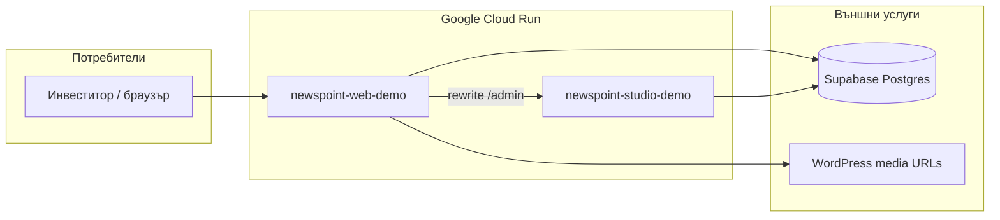

# План: временен online demo в Google Cloud

## Цел

Да показваш на инвеститори **реалния** NewsPoint 2.0 (сайт + Studio) през публичен HTTPS URL, без да заключваш финалния production на GCP.

## Архитектура

- **Web:** начало, статии, категории, търсене, LivePoint (където има ключове).
- **Studio:** `/admin` през същия host (rewrite), Better Auth, редакция.
- **Не качваме** worker/sync в този demo slice — съдържанието идва от вече импортирана Supabase база.

## CI/CD

| Вариант | Кога |
|---------|------|
| **Cloud Build trigger** (препоръчително) | Repo е свързан в GCP Console |
| **GitHub Actions** `gcp-demo-deploy.yml` | WIF + service account в GitHub secrets |

И двата варианта ползват същите Dockerfile-и и `deploy-cloudrun.sh`.

## Какво НЕ е включено (умишлено)

- Custom домейн / CDN / Redis
- WordPress sync worker на cron (може да се добави отделно)
- Production hardening (WAF, min-instances SLA, multi-region)
- Премахване на `X-Robots-Tag: noindex` (demo остава noindex)

## Разходи (ориентир)

- Cloud Run: pay-per-use; при demo трафик — ниски, освен ако не държиш `min-instances=1`.
- Artifact Registry: малко storage за Docker layers.
- Secret Manager: малко на брой secrets.
- Supabase: съществуващият проект (извън GCP billing).

## Checklist преди показване

- [ ] Supabase `DATABASE_URL` (pooler 6543) в Secret Manager
- [ ] `STUDIO_SESSION_SECRET` ≥ 32 символа
- [ ] Поне един Studio потребител (`pnpm studio:user` локално срещу същата база)
- [ ] След първи deploy: отвори `WEB_URL/` и `WEB_URL/admin/login/`
- [ ] По желание: `RESEND_API_KEY` за reset password; иначе `STUDIO_PASSWORD_RESET_LOG=1`
- [ ] Анкети: `POLL_TRUSTED_IP_HEADER=x-forwarded-for` на web service (Cloud Run)

## Следващи стъпки (технически)

1. Изпълни `SETUP.md` в GCP проект.
2. Commit + push на този repo → провери Cloud Build log.
3. Запиши demo URL в бележки за инвеститорската среща.
4. След production миграция: `REMOVAL.md`.
